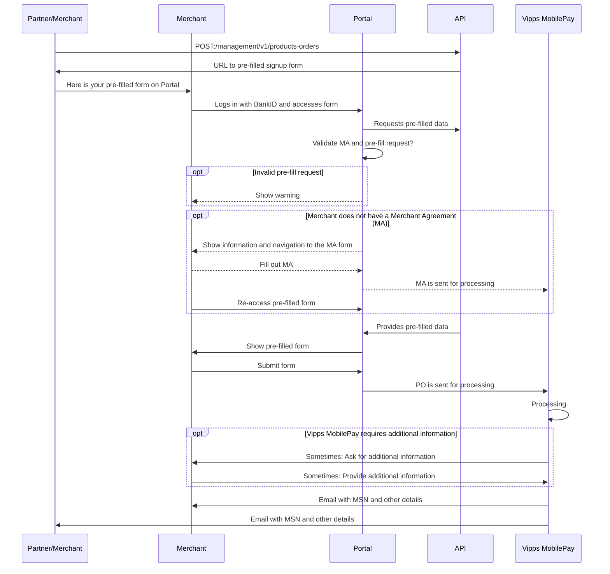

# API guide

 *Available for Vipps. New features are under development now. See [Ideas and proposals](#ideas-and-proposals).*

 *Available for MobilePay in selected markets at the [Vipps MobilePay joint platform launch](https://www.vippsmobilepay.com/about).*

The Management API enables partners and merchants to manage their sales units, and allows for
self-service for the most common tasks. Our goal is to enable partners and merchants to do
as much as possible without needing assistance.

**Please note:**
This API replaces the Partner API and expands upon the functionality.
[More new features](#ideas-and-proposals) will soon be added in the coming months.

## Integrating with this API

Both partners and *soon* merchants can use the Management API, and we use "partner/merchant" to
indicate that this is the actor making the API request.

Authentication:

* Partners use their
  [partner keys](https://developer.vippsmobilepay.com/docs/partner/partner-keys)
  to access the API
* Soon: Merchants will be able to use their normal
  [API keys](https://developer.vippsmobilepay.com/docs/knowledge-base/api-keys/).

See the
[Quick start guide](management-api-quick-start.md) for examples.

## Endpoints and availability

These endpoints are available now (or very soon):

| Endpoint | Description |
| -------- | ----------- |
| Merchants: | |
| [`GET:/management/v1/merchants/{scheme}/{id}/sales-units`](https://developer.vippsmobilepay.com/api/management/#tag/Merchants/operation/getMerchantSalesUnits) | [Get the sales units for a merchant by business identifier](#get-the-sales-units-for-a-merchant-by-business-identifier). Get a list of all the sales units that belong to the specified merchant. |
| [`GET:/management/v1/merchants/{scheme}/{id}`](https://developer.vippsmobilepay.com/api/management/#tag/Merchants/operation/getMerchantByBusinessIdentifier) | [Get one merchant by business identifier](#get-one-merchant-by-business-identifier). |
| Sales units: | |
| [`GET:/management/v1/sales-units/{msn}`](https://developer.vippsmobilepay.com/api/management/#tag/Sales-units/operation/getMsn) | [Get information about a sales unit](#get-information-about-a-sales-unit). Get details about one sales unit (MSN). |
| [`GET:/management/v1/sales-units`](https://developer.vippsmobilepay.com/api/management/#tag/Ideas/operation/getAllSalesUnits) | [Get all sales units](#get-all-sales-units). An easy way to get a list of all the sales units connected to the requesting merchant or partner. |
| Product orders: | |
| [`POST:/management/v1/products-orders`](https://developer.vippsmobilepay.com/api/management/#tag/Product-orders/operation/orderProduct) | [Pre-fill a product order](#pre-fill-a-product-order). Allows for "pre-fill" of the product order form on portal.vipps.no, ensuring correct information, a simple experience for the merchant, and speedy processing of the product order.  |
| [`GET:/management/v1/product-orders/{product-order-id}`](https://developer.vippsmobilepay.com/api/management/#tag/Ideas/operation/productOrderDetails) | [Get information about a product order](#get-information-about-a-product-order). *Available in Q4, aiming for mid-November.* |
| [`DELETE:/management/v1/product-orders/{product-order-id}`](https://developer.vippsmobilepay.com/api/management/#tag/Ideas/operation/deleteProductOrder) | [Delete a product order](#delete-a-product-order). *Available in Q4, aiming for mid-November.* |
| Partners: | |
| [`GET:/management/v1/partners/price-packages`](https://developer.vippsmobilepay.com/api/management/#tag/Partners/operation/getPartnerPricePackages) | [Get the price packages for a partner](#get-the-price-packages-for-a-partner). Enables a partner to retrieve its price package details.  The price packages are needed for pre-filling the product orders. |
More functionality will be available soon, see:
[Ideas and proposals](#ideas-and-proposals).

## Merchants

### Get the sales units for a merchant by business identifier

Status: ✅ Available.

[`GET:/management/v1/merchants/{scheme}/{id}/sales-units`](https://developer.vippsmobilepay.com/api/management/#tag/Merchants/operation/getMerchantSalesUnits)

Response:

```json
{
   "salesUnits":[
      {
         "msn": 123456,
         "name": "ACME Fantastic Fitness"
      }
      {
         "msn": 654321,
         "name": "ACME Candy and Ice Cream"
      }
   ]
}
```

### Get one merchant by business identifier

Status: ✅ Available.

This endpoint is for retrieving basic information about the merchant:

[`GET:/management/v1/merchants/{scheme}/{id}`](https://developer.vippsmobilepay.com/api/management/#tag/Merchants/operation/getMerchant)

Response:

```json
{
  "merchant": {
    "businessidentifier": {
      "scheme": "business:NO:ORG",
      "id": "9876543221"
    },
    "name": "ACME Fantastic Fitness",
    "status": "ACTIVE",
    "createdAt": "2022-09-02T06:45:25.921251Z",
    "updatedAt": "2022-09-02T06:45:25.921251Z",
    "countryCode\"": "NO",
    "businessAddress": {
      "city": "Oslo",
      "country": "NO",
      "id": "3fa85f64-5717-4562-b3fc-2c963f66afa6",
      "lines": [
        "Robert Levins gate 5"
      ],
      "postCode": "0154"
    },
    "businesspostAddress": {
      "city": "Oslo",
      "country": "NO",
      "id": "3fa85f64-5717-4562-b3fc-2c963f66afa6",
      "lines": [
        "Robert Levins gate 5"
      ],
      "postCode": "0154"
    }
  }
}
```

Future versions of the API will *probably* return more information,
and we will work with our partners to find out what is useful and possible.
Some candidates:

* Contact information for the main person (depends on GDPR)
* Contact information for the technical person (depends on GDPR)
* A list of people with admin rights on [portal.vipps.no](https://portal.vipps.no) (depend on GDPR)
* Changelog: What was changed when by whom?

## Sales units

### Get information about a sales unit

Status: ✅ Available.

This endpoint is for retrieving details about one sales unit (MSN), but only
when both the merchant and sales unit are active.
If the merchant is not active, or the sales unit is not active, the response
will be a `HTTP 404 Not Found` error.

[`GET:/management/v1/sales-units/{msn}`](https://developer.vippsmobilepay.com/api/management/#tag/Sales-units/operation/getMsn)

Response (now):

```json
{
   "msn":"123456",
   "name":"ACME Fantastic Fitness",
   "businessIdentifier":{
      "scheme":"business:NO:ORG",
      "id":"9876543221"
   },
   "configuration":{
      "paymentAllowed":true,
      "captureType":"ReserveCapture",
      "skipLandingPageAllowed":false,
      "recurringAllowed":false
   }
}
```

Response (this improvement is provided for discussions of what we should investigate further):

```json
{
   "msn":"123456",
   "name":"ACME Fantastic Fitness",
   "businessIdentifier":{
      "scheme":"business:NO:ORG",
      "id":"9876543221"
   },
   "configuration":{
      "paymentAllowed":true,
      "captureType":"ReserveCapture",
      "skipLandingPageAllowed":false,
      "recurringAllowed":false,
      "customerMustBePresent":false,
      "userinfoNinAllowed":false,
   },
   "bankDetails": {
      "bankAccount": {
         "id": "NO93 8601 1117 947",
         "scheme": "IBAN"
      }
   },
   "changelog": [
      {
         "timestamp": "2022-12-31T00:00:00Z",
         "change": "MSN created",
         "changedBy":"Vipps MobilePay"
      },
      {
         "timestamp": "2023-01-01T00:00:00Z",
         "change": "skipLandingPage set to true",
         "changedBy": "Merchant, using Management API"
      },
      {
         "timestamp": "2023-11-15T00:00:00Z",
         "change": "NIN allowed",
         "changedBy": "Vipps MobilePay"
      },
      {
         "timestamp": "2023-06-01T00:00:00Z",
         "change": "Updated MSN name",
         "changedBy": "Merchant, using the portal"
      },
   ]   
}
```

The `businessIdentifier` is included to make it possible to find out the merchant that is associated with an MSN.
This is useful when only the MSN is known.

Future versions of the API will *probably* return more information,
and we will work with our partners to find out what is useful and possible.
Some candidates:

* Products: Which products and APIs are available for this MSN ("ePayment API", "Recurring API", "Login API", etc.).
* Transaction cost (price package)
* Status: Active or deactivated

### Get all sales units

Status: ✅ Available.

Get all sales units that a merchant or partner has access to.

For partners using
[partner keys](https://developer.vippsmobilepay.com/docs/partner/partner-keys):
Get a (long) list of all sales units registered with the partner making the API call,
containing sales units that are active for an active merchant.

[`GET:/management/v1/sales-units`](https://developer.vippsmobilepay.com/api/management/#tag/Sales-units/operation/getAllSalesUnits)

Response:

```json
{
   "salesUnits":[
      {
         "msn": 123456,
         "name": "ACME Fantastic Fitness"
      }
      {
         "msn": 654321,
         "name": "ACME Candy and Ice Cream"
      }
   ]
}
```

It is then possible to use
[`GET:/management/v1/sales-units/{msn}`](https://developer.vippsmobilepay.com/api/management/#tag/Sales-units/operation/getMsn)
to get each MSN's details, including the `businessIdentifier` of the merchant it belongs to.

## Product orders

### Pre-fill a product order

Status: ✅ Available.

This endpoint allows for "pre-fill" of the product order form on
[portal.vipps.no](https://portal.vipps.no).
This ensures that all the data in the form is correctly filled in, and can also "lock" parameters that are
normally selectable. Product orders that have been pre-filled this way are
processed faster, since they are correct and contain all the required information.

The response from a pre-fill request contains a URL to
[portal.vipps.no](https://portal.vipps.no).
The merchant simply uses the URL to get to the pre-filled product order, checks the data, and submits.

**Please note:** The merchant cannot change the `pricePackageId` provided by the partner, so if
it needs to be corrected, the merchant must contact the partner to have
the partner submit a new pre-fill product order with the correct details.

<details>
<summary>Example request</summary>
<div>

Here is a sample request to
[`POST:/management/v1/products/orders`](https://developer.vippsmobilepay.com/api/management/#tag/Product-orders/operation/orderProduct):

```json
{
  "businessIdentifier": {
    "scheme": "business:NO:ORG",
    "id": "9876543221"
  },
  "salesUnitName": "ACME Fantastic Fitness",
  "salesUnitLogo": "VGhlIGltYWdlIGdvZXMgaGVyZQ==",
    "settlementBankAccount": {
      "scheme": "BBAN:NO",
      "id": "86011117947"
  },
  "pricePackageId": "8a11afb7-c223-48ed-8ca6-4722b97261aa",
  "productType": "VIPPS_PA_NETT",
  "productUseCase": "WebsiteWithTest",
  "annualTurnover": 100000,
  "intendedPurpose": "Gym membership for accessing the gym's facilities. Guests will be not physically present when buying the subscription, as that is done on the gym's website.",
  "website": {
    "url": "https://example.com",
    "termsUrl": "https://example.com/terms-and-conditions",
    "testWebsiteUrl": "https://example.com/test ",
    "testWebsiteUsername": "test-user",
    "testWebsitePassword": "test-password"
  },
  "complianceData": {
    "giftCard": {
      "isSalesPercentageLessThanTen": false,
      "validityDuration": "3 years",
      "giftCardTurnoverShare": "about 25%"
    },
    "membership": {
      "turnoverShare": "about 25%",
      "membershipValidity": "CurrentCalendarYear",
      "periodDistribution": "50% yearly 20% monthly"
    },
    "subscription": {
      "turnoverShare": "about 25%",
      "periodDistribution": "50% yearly 20% monthly"
    },
    "course": {
      "turnoverShare": "about 25%",
      "timeBeforeOrder": "10 days",
      "period": "once every 6. week",
      "isOnlineCourseOffered": false,
      "onlineAccessibleTime": "for 3 months"
    },
    "ticket": {
      "turnoverShare": "about 25%",
      "prepurchaseTime": "10 weeks"
    },
    "rent": {
      "turnoverShare": "about 25%",
      "prepurchaseTime": "15 days",
      "averageRentalDuration": "3 weeks"
    },
    "prepaidServices": {
      "turnoverShare": "about 25%",
      "prepurchaseTime": "10 weeks"
    },
    "donation": {
      "acceptsDonation": false
    }
  }
}
```

**Important:** Please provide all the required fields, so it will not be necessary for
merchants to request more details. This is the most
[typical reason for delays](https://developer.vippsmobilepay.com/docs/partner/#typical-reasons-for-delays).

We have made as many of the fields as possible optional, but please
try to send as much as possible, to make it easy for the merchant.

Response:

```json
{
  "prefilledOrderId": "81b83246-5c19-7b94-875b-ea6d1114f099",
  "prefillUrl": "https://portal.vipps.no/register/vippspanett/81b83246-5c19-7b94-875b-ea6d1114f099"
}
```

</div>
</details>

#### Processing of the pre-filled product order

When the submitted product order has been processed, an email is sent to both the
partner/merchant making the request and the merchant that submitted the pre-filled product order.
This will include information about:

* The merchant's business identifier
* The merchant's name
* The sales unit's MSN
* The sales unit's name

#### About "Product Order" (PO) and "Merchant Agreement" (MA)

Merchants must have both a valid Merchant Agreement (MA) and an approved
Product Order (PO) to be able to use Vipps MobilePay products.

* MA: An agreement between the merchant and Vipps MobilePay, signed with BankID.
  The MA contains information about all direct and indirect owners, any
  politically exposed persons, etc.
* PO: This is an order for a specific product. The merchant
  must provide some information about the use, whether the cardholder is
  present, etc. The PO is not signed with BankID.
  A merchant may have several products, each created with a separate PO.

A merchant may order a product (submit a product order, "PO") with or
without an existing Merchant Agreement ("merchant agreement", "MA").

#### Scenarios

**Please note:** The only way we can verify that a user is allowed
to sign a merchant agreement for a merchant is by using data from the
[Brønnøysundregistrene, the Norwegian business registry](https://brreg.no).
It is therefore a requirement that the user signed in to the
[merchant portal](https://portal.vipps.no)
is registered as chairman of the board (*styreleder*) or CEO (*daglig leder*).
The user will then automatically be presented with the pre-filled PO.

##### Scenario 1: The merchant does not have a Merchant Agreement

1. The partner/merchant pre-fills the PO using
   [`POST:/management/v1/products-orders`](https://developer.vippsmobilepay.com/api/management/#tag/Product-orders)
   and gets a link to the pre-filled PO on
   [portal.vipps.no](https://portal.vipps.no).
2. The merchant uses the link and logs in with BankID on
   [portal.vipps.no](https://portal.vipps.no).
3. The merchant is presented with a page informing them that they need to
   sign an MA before filling in the PO.
4. The merchant completes, signs and submits the MA.
5. The merchant re-uses the link or finds the link to the pre-filled PO form on the
   front page on
   [portal.vipps.no](https://portal.vipps.no)
   and is presented with the pre-filled PO,
   checks the details in the PO and submits it.
6. We process the PO and send both the merchant and partner/merchant who made the pre-fill request an
   email when done. The partner/merchant who made the pre-fill request can also check with the API:
   [`GET:/management/v1/merchants/{scheme}/{id}`](https://developer.vippsmobilepay.com/api/management/#tag/Merchants/operation/getMerchantByBusinessIdentifier).

The most important part of the merchant agreement form is the *reelle rettighetshavere*
(*real rights holders*), meaning the people with direct or indirect ownership or
rights for the business. This is not something the partner can be expected to
know, and in any case this is information that must be signed with BankID by a
person that has signatory rights for the merchant. The form looks like this:

##### Scenario 2: The merchant has an active or processing Merchant Agreement

The merchant has an MA and probably also a Vipps MobilePay product.

1. The partner/merchant pre-fills the PO using
   [`POST:/management/v1/products/orders`](https://developer.vippsmobilepay.com/api/management/#tag/Product-orders)
   and gets a link to the pre-filled PO on
   [portal.vipps.no](https://portal.vipps.no).
2. The merchant uses the link and logs in with BankID on
   [portal.vipps.no](https://portal.vipps.no).
3. The merchant is presented with the pre-filled PO,
   checks the details and submits it.
4. We process the PO and send both the merchant and partner/merchant who made the pre-fill request an
   email when done. The partner/merchant who made the pre-fill request can also check with the API:
   [`GET:/management/v1/merchants/{scheme}/{id}`](https://developer.vippsmobilepay.com/api/management/#tag/Merchants/operation/getMerchantByBusinessIdentifier).

In the future, we may allow the merchant to change some data pre-filled by the
partner, but this is not trivial. If the merchant changes any data, the
partner must be notified and also get the updated data - then merge and sync that
with the "old" data that was sent in the first place.

#### Sequence diagram for pre-fill

PO: Product order. MA: Merchant agreement.



### Get information about a product order

Status: 🟡 Available in Q4, aiming for mid November.

For both merchants and partners.

[`GET:/management/v1/product-orders/{product-order-id}`](https://developer.vippsmobilepay.com/api/management/#tag/Ideas/operation/productOrderDetails)

Here is an overview of statuses to be returned:

| Status       | Description                                           | Realistic?    | Comment                 |
| ------------ | ----------------------------------------------------- | ------------- | ----------------------- |
| `CREATED`    | The PO exists, but nothing has been done with it yet. | ✅ Yes.       |                         |     
| `OPENED`     | The PO URL has been accessed.                         | ✅ Yes.       |                         | 
| `SUBMITTED`  | The merchant has clicked "Send" on the PO.            | ✅ Yes.       |                         | 
| `PENDING`    | Processing has not started yet.                       | Maybe not.    |  We may not be able to provide this.                        | 
| `PROCESSING` | Processing has started.                               | Maybe not.    |  We may not be able to provide this.                        | 
| `AWAITING-CUSTOMER` | We are waiting for the merchant to respond.    | Maybe not.    |  We may not be able to provide this.                       |
| `APPROVED`   | Everything OK: The merchant is approved and active.   | Maybe not.    |  Similar to [`GET:/management/v1/merchants/{scheme}/{id}/sales-units`](https://developer.vippsmobilepay.com/docs/APIs/management-api/management-api-guide/#get-the-sales-units-for-a-merchant-by-business-identifier)                       | 
| `STOPPED`   | May be: Cancelled by the partner because of incorrect pre-fill data, or rejected by us because something is not OK (high risk, etc). | Maybe not.    | We may not be able to provide this.                           |

**Please note:** 
* There are strict rules for what information we are
  allowed to share with a partner. Implementing a very detailed
  status functionality may not be possible.
* The best way to check the status of a product order is on
  [portal.vipps.no](https://portal.vipps.no).

### Delete a product order

Status: 🟡 Available in Q4, aiming for mid November.

An "undo" endpoint to delete a PO.
This may be used if an incorrect PO has been pre-filled with
[`POST:/management/v1/product-orders`](https://developer.vippsmobilepay.com/api/management/#tag/Ideas/operation/orderProduct).

[`DELETE:/management/v1/product-orders/{product-order-id}`](https://developer.vippsmobilepay.com/api/management/#tag/Ideas/operation/deleteProductOrder)

## Partners

### Get the price packages for a partner

Status: ✅ Available.

Partners can use this endpoint to get a list of all their price packages, with the
`pricePackageId` to use for
[`POST:/management/v1/products/orders`](https://developer.vippsmobilepay.com/api/management/#tag/Product-orders/operation/orderProduct),
as well as other details.

[`GET:/management/v1/partners/price-packages`](https://developer.vippsmobilepay.com/api/management/#tag/Partners/operation/getPartnerPricePackages)

Response:

```json
[
  {
    "pricePackageId": "8a11afb7-c223-48ed-8ca6-4722b97261aa",
    "name": "POS standard",
    "description": "2.99%",
    "visibleInSignupForm": true,
    "productType": "ePayment"
  }
]
```

## Ideas and proposals

| Endpoint | Description |
| -------- | ----------- |
| Merchants: | |
| [`GET:/management/v1/merchants`](https://developer.vippsmobilepay.com/api/management/#tag/Ideas/operation/getAllMerchants) | [Get all merchants](#get-all-merchants). |
| [`GET:/management/v1/merchants/{scheme}/{id}/contracts`](https://developer.vippsmobilepay.com/api/management/#tag/Ideas/operation/getMerchantContracts) | [Get a merchant's contract(s)](#get-a-merchants-contracts). |
| [`PATCH:/management/v1/sales-units/{msn}`](https://developer.vippsmobilepay.com/api/management/#tag/Ideas/operation/updateMsn) | [Update sales unit](#update-sales-unit). |
| Partners: | | |
| [`GET:/management/v1/partners/whoami`](https://developer.vippsmobilepay.com/api/management/#tag/Ideas/operation/getPartnerWhoami) | [Get information about a partner](#get-information-about-a-partner).  |
| API quality: | | |
| [`GET:/management/v1/api-quality/sales-units/{msn}`](https://developer.vippsmobilepay.com/api/management/#tag/Ideas/operation/getApiQuality) | [API quality](#api-quality). |

### Get all merchants

Status: 💡 Idea/proposal.

For partners using
[partner keys](https://developer.vippsmobilepay.com/docs/partner/partner-keys):
Get a (long) list of all `businessIdentifier`s that have one or more sales units registered with the partner making the API call.

[`GET:/management/v1/merchants`](https://developer.vippsmobilepay.com/api/management/#tag/Ideas/operation/getAllMerchants)

Response:

```json
{
   "merchants":[
      {
         "businessIdentifier":{
            "scheme":"business:NO:ORG",
            "id":"987654321"
         },
         "name": "ACME Fantastic Fitness"
      },
      {
         "businessIdentifier":{
            "scheme":"business:NO:ORG",
            "id":"987654322"
         },
         "name": "ACME Candy and Ice Cream"
      }
   ]
}
```

If this endpoint is used with normal API keys (not partner keys), it will return just one merchant:
The one making the API request.

### Get a merchant's contract(s)

Status: 💡 Idea/proposal.

Return a (link to a) PDF.

[`GET:/management/v1/merchants/{scheme}/{id}/contracts`](https://developer.vippsmobilepay.com/api/management/#tag/Ideas/operation/getMerchantContracts)

Response:

```json
{
  "urls": [
    "https://example.com/contracts/contract-12345.pdf"
  ]
}
```

### Update sales unit

Status: 💡 Idea/proposal.

May be used to update a sales unit, for instance the name or the status.

[`PATCH:/management/v1/sales-units/{msn}`](https://developer.vippsmobilepay.com/api/management/#tag/Ideas/operation/updateMsn)

Example `PATCH` request body:

```json
{
  "name": "ACME Fantastic Fitness Deluxe",
  "salesUnitLogo": "VGhlIGltYWdlIGdvZXMgaGVyZQ==",
  "status": "ACTIVE"
}
```


### Get information about a partner

Status: 💡 Idea/proposal.

For partners using
[partner keys](https://developer.vippsmobilepay.com/docs/partner/partner-keys):
Get details for the partner making the request.

[`GET:/management/v1/partners/whoami`](https://developer.vippsmobilepay.com/api/management/#tag/Ideas/operation/getPartnerWhoami)

Response:

```json
{
   "partnerId": "123456",
   "name": "ACME Partner Inc",
   "level": "Partner Premium",
   "partnerContactName": "firstName lastName",
   "partnerContactEmail": "firstname.lastname@vippsmobilepay.com",
   "status": "ACTIVE"
}
```

If this endpoint is used with normal API keys (not partner keys), it will return an error.

### API quality

Status: 💡 Idea/proposal.

We want to offer an API endpoint that lets merchants and partners retrieve the same
information that is available on the
[API Dashboard](https://developer.vippsmobilepay.com/docs/developer-resources/api-dashboard/).

This will make it easier to monitor usage the API platform.

[`GET:/management/v1/api-quality/sales-units/{msn}`](https://developer.vippsmobilepay.com/api/management/#tag/Ideas/operation/getApiQuality)

Response:

```json
{
   "ApiQualityItems":[
      {
         "endpoint":"POST:/epayment/v1/payments",
         "total Requests":1000,
         "successRate":95,
         "status200":950,
         "status400":10,
         "status401":10,
         "status403":10,
         "status404":10,
         "status429":10,
         "status500":0
      }
   ]
}
```

**Please note:** Monitoring API errors and fixing them quickly is a requirement in
the checklists for all APIs. For example, see:

* [ePayment API checklist](https://developer.vippsmobilepay.com/docs/APIs/epayment-api/checklist/)
* [Recurring API checklist](https://developer.vippsmobilepay.com/docs/APIs/recurring-api/recurring-api-checklist/)

See [HTTP response codes and errors](https://developer.vippsmobilepay.com/docs/knowledge-base/errors/) for examples of common errors.
