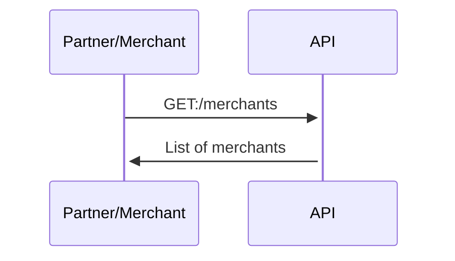
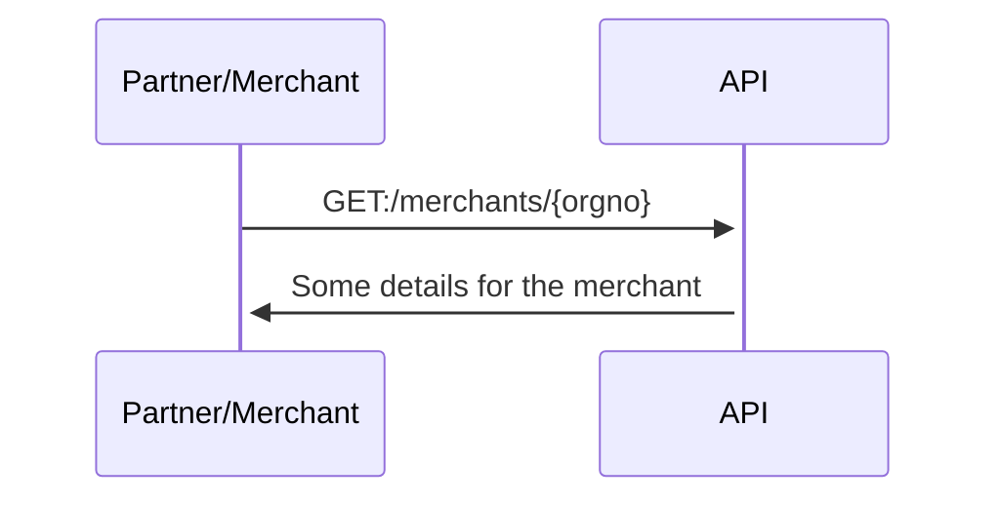
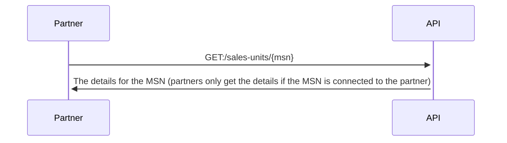

# API guide

💥
**DRAFT!** The Management API is in development, but not yet available.
This documentation is a working document, and used in discussions with
merchants and partners to make sure we are prioritizing right,
and that we are implementing the right functionality.
The Management API will replace the
[Partner API](https://developer.vippsmobilepay.com/docs/APIs/partner-api/).
💥

## Integrating with this API

Both partners and merchants can use the Management API, and we use "partner/merchant" to
indicate that this is the actor making the API request.

Authentication:

* Merchants use their normal
  [API keys](https://developer.vippsmobilepay.com/docs/vipps-developers/common-topics/api-keys/).
* Partners use their [partner keys](https://developer.vippsmobilepay.com/docs/vipps-partner/partner-keys)
  if they have them, and the merchant's API keys if not.

See the Postman collection and environment, and the
[Quick start guide](management-api-quick-start.md).
The Postman collection can also be used to manually make API calls,
even without an integration in place.

## Get all merchants

For partners using
[partner keys](https://developer.vippsmobilepay.com/docs/vipps-partner/partner-keys):
Get a (long) list of all orgnos that have one or more sale units registered with the partner making the API call.

[`GET:/merchants`](https://developer.vippsmobilepay.com/api/management/#tag/Merchants/operation/getAllMerchants)

Response:

```json
{
   "MerchantList":[
      {
         "orgno": 987654321,
         "name": "ACME Fantastic Fitness"
      }
      {
         "orgno": 987654322,
         "name": "ACME Fantastic Fitness 2"
      }
   ]
}
```

Sequence diagram:



## Get one merchant by organization number

This endpoint is for retrieving basic information about the merchant:

[`GET:/merchants/{orgno}`](https://developer.vippsmobilepay.com/api/management/#tag/Merchants/operation/getMerchant)

Response:

```json
{
  "orgno": 987654321,
  "name": "ACME Fantastic Fitness"
}
```

Sequence diagram:



### Future improvements

Future versions of the API will _probably_ return more information,
and we will work with our partners to find out what is useful and possible.
Some candidates:

* Company address
* Contact information for the main person (depends on GDPR, etc.)
* Contact information for the technical person (depends on GDPR, etc.)
* A list of people with admin rights on portal.vipps.no (depends on GDPR, etc.)
* Changelog: What was changed when by whom?

## Get a merchant's contract(s)

Just an idea. May return a (link to a) PDF.

[`GET:/merchants/{orgno}/contracts`](https://developer.vippsmobilepay.com/api/management/#tag/Merchants/operation/getMerchantContracts)

## Get all sales units

For partners using
[partner keys](https://developer.vippsmobilepay.com/docs/vipps-partner/partner-keys):
Get a (long) list of all sales units registered with the partner making the API call.

[`GET:/sales-units`](https://developer.vippsmobilepay.com/api/management/#tag/Sales-units/operation/getAllSalesUnits)

Response:

```json
{
  "msn": [
     "123456",
     "123457"
   ]
}
```

## Get the sales units for a merchant by orgno

[`GET:/merchants/{orgno}/sales-units`](https://developer.vippsmobilepay.com/api/management/#tag/Merchants/operation/getMerchantSalesUnits)

Response:

```json
{
  "msn": [
     "123456",
     "123457"
   ]
}
```

## Get information about a sales unit

This endpoint is for retrieving details about one sales unit (MSN):

[`GET:/sales-units/{msn}`](https://developer.vippsmobilepay.com/api/management/#tag/Sales-units/operation/getMsn)

Sequence diagram:



The response (work in progress, we would like input on what is needed here):

```json
{
   "msn":"123456",
   "name":"ACME Fantastic Fitness",
   "orgno":987654321,
   "additionalDetails":{
      "skipLandingPage":false,
      "isPureLogin":false,
      "captureType":"ReserveCapture",
      "recurring":false
   }
}
```

The `orgno` is included to make it possible to find out which merchant an MSN
belongs to, which is useful if only the MSN is known.

### Future improvements

Future versions of the API will _probably_ return more information,
and we will work with our partners to find out what is useful and possible.
Some candidates:

* Vipps products: Which Vipps products and APIs are available for this MSN ("eCom API", "Recurring API", "Login API", etc.).
* Transaction cost (price package)
* Status: Active or deactivated

## Update sales unit

May be used to update a sales unit, for instance the name or the status.

[`PATCH:/sales-units/{msn}`](https://developer.vippsmobilepay.com/api/management/#tag/Sales-units/operation/updateMsn)

Example `PATCH` request body:

```json
{
  "name": "ACME Fantastic Fitness DeLuxe",
  "status": "ACTIVE"
}
```

## Pre-fill a product order

This endpoint lets a partner "pre-fill" the product order form on
[portal.vipps.no](https://portal.vipps.no)
on behalf of a merchant, so the merchant can log in, check the data, and submit
the product order:

[`POST:/product-orders`](https://developer.vippsmobilepay.com/api/management/#tag/Product-orders/operation/orderProduct)

### About "Product Order" (PO) and "Merchant Agreement" (MA)

Merchants must have both a valid Merchant Agreement (MA) and an approved
Product Order (PO) to be able to use Vipps products.

* MA: An agreement between the merchant and Vipps, signed with BankID.
  The MA contains information about all direct and indirect owners, any
  politically exposed persons, etc.
* PO: This is an order for "Vipps på nett", "Vipps Login", etc. The merchant
  must provide some information about the use, whether the cardholder is
  present, etc. The PO is not signed with BankID.
  A merchant may have several Vipps products, each created with a separate PO.

A merchant may order a Vipps product (submit a product order, "PO") with or
without an existing Merchant Agreement ("merchant agreement", "MA").

Both MA and PO are described in detail in
[Scenarios](#scenarios).

### Sequence diagram for pre-fill

PO: Product order. MA: Merchant agreement.


Here is a sample request to
[`POST:/products/orders`](https://developer.vippsmobilepay.com/api/partner#tag/Vipps-Product-Orders/operation/orderProduct):

```json
{
  "orgno": "987654321",
  "salesUnitName": "ACME Fantastic Fitness",
  "salesUnitLogo": "VGhlIGltYWdlIGdvZXMgaGVyZQ==",
  "settlementAccountNumber": "86011117947",
  "pricePackageId": "8a11afb7-c223-48ed-8ca6-4722b97261aa",
  "productType": "VIPPS_PA_NETT",
  "mcc": "5200",
  "annualTurnover": "100000",
  "intendedPurpose": "Gym membership",
  "website": {
    "url": "https://example.com",
    "termsUrl": "https://example.com/terms-and-conditions",
    "testWebSiteUrl": "https://example.com/test ",
    "testWebsiteUsername": "test-user",
    "testWebsitePassword": "test-password"
  }
}
```

The response:

```json
{
  "prefilledOrderId": "81b83246-5c19-7b94-875b-ea6d1114f099",
  "prefillUrl": "https://portal.vipps.no/register/vippspanett/81b83246-5c19-7b94-875b-ea6d1114f099"
}
```

**Please note:** The merchant cannot change the information provided in the request, so if
something needs to be corrected, a new request with the correct details must be made.

When the submitted order has been processed, an email is sent to both the
partner/merchant making the request and the merchant that submitted the pre-filled product order
with information about:

* The merchant's organization number
* The merchant's name
* The sales unit's MSN
* The sales unit's name

This may be useful:
[Typical reasons for delays](https://developer.vippsmobilepay.com/docs/vipps-partner#typical-reasons-for-delays).

### Scenarios

**Please note:** The only method Vipps has to verify that a user has the right
to sign an MA for a merchant is by using data from
[Brønnøysundregistrene](https://brreg.no).
It is therefore a requirement that the user logging in on
[portal.vipps.no](https://portal.vipps.no)
is registered as chairman of the board ("styreleder") or CEO ("daglig leder").
The user will then automatically be presented with the pre-filled PO.

#### Scenario 1: The merchant does not have a Merchant Agreement

1. The partner/merchant pre-fills the PO using
   [`POST:/products-orders`](https://developer.vippsmobilepay.com/api/partner#tag/Vipps-Product-Orders/operation/orderProduct)
   and gets a link to the pre-filled PO on
   [portal.vipps.no](https://portal.vipps.no).
2. The merchant uses the link and logs in with BankID on
   [portal.vipps.no](https://portal.vipps.no).
3. The merchant is presented with a page informing them that they need to
   sign an MA before filling in the PO.
4. The merchant re-uses the link or finds the link to the pre-filled form on the
   front page on
   [portal.vipps.no](https://portal.vipps.no)
   and is presented with the pre-filled PO,
   checks the details in the PO and submits it.
5. Vipps processes the PO and sends both the merchant and partner/merchant who made the pre-fill request an
   email when done. The partner/merchant who made the pre-fill request can also check with the API:
   [`GET:/merchants/{orgno}`](https://developer.vippsmobilepay.com/api/partner#tag/Merchants/operation/getMerchant).

When using the pre-fill link without a valid MA:


The most important part of the MA form is the "reelle rettighetshavere"
("real rights holders"), meaning the people with direct or direct ownership or
rights for the company. This is not something the partner can be expected to
know, and in any case this is information that must be signed with BankID by a
person that has signatory rights for the merchant. The form looks like this:


#### Scenario 2: The merchant has an active or processing Merchant Agreement

The merchant has an MA, and probably also a Vipps product.

1. The partner/merchant pre-fills the PO using
   [`POST:/products/orders`](https://developer.vippsmobilepay.com/api/partner#tag/Vipps-Product-Orders/operation/orderProduct)
   and gets a link to the pre-filled PO on
   [portal.vipps.no](https://portal.vipps.no).
2. The merchant uses the link and logs in with BankID on
   [portal.vipps.no](https://portal.vipps.no).
3. The merchant is presented with the pre-filled PO,
   checks the details in the PO and submits it.
4. Vipps processes the PO and sends both the merchant and partner/merchant an
   email when done.
   The partner/merchant who made the pre-fill request can also check with the API:
   [`GET:/merchants/{orgno}`](https://developer.vippsmobilepay.com/api/partner#tag/Merchants/operation/getMerchant).

### Future improvements

* We may allow the merchant to change some data pre-filled by the
  partner, but this is not trivial. If the merchant changes any data, the
  partner must be notified and also get the updated data - then merge and sync that
  with the "old" data that was sent in the first place.

## Get information about a product order

For both merchants and partners. The best way to check the status of a product order is on
[portal.vipps.no](https://portal.vipps.no).

We are considering an endpoint like this:

[`GET:/product-orders/{product-order-id}`](https://developer.vippsmobilepay.com/api/management/#tag/Product-orders/operation/productOrderDetails)

**Please note:** There are strict rules for what information we are
allowed to share with a partner, as this requires active consent from the merchant,
and the merchant must also be able to withdraw the consent.

## Delete a product order

An "undo" endpoint to delete a PO.
This may be used if an incorrect PO has been pre-filled with
[`POST:/product-orders`](https://developer.vippsmobilepay.com/api/management/#tag/Product-orders/operation/orderProduct).

[`DELETE:/product-orders/{product-order-id}`](https://developer.vippsmobilepay.com/api/management/#tag/Product-orders/operation/deleteProductOrder)

## Get information about a partner

For partners using
[partner keys](https://developer.vippsmobilepay.com/docs/vipps-partner/partner-keys):
Get details for the partner making the request.

[`GET:/partners/whoami`](https://developer.vippsmobilepay.com/api/management/#tag/Partners/operation/getPartnerWhoami)

Response:

```json
{
   "partnerId": "123456",
   "name": "ACME Partner Inc",
   "level": "Vipps Partner Premium",
   "partnerContactName": "firstName lastName",
   "partnerContactEmail": "firstname.lastname@vippsmobilepay.com",
   "status": "ACTIVE"
}
```
