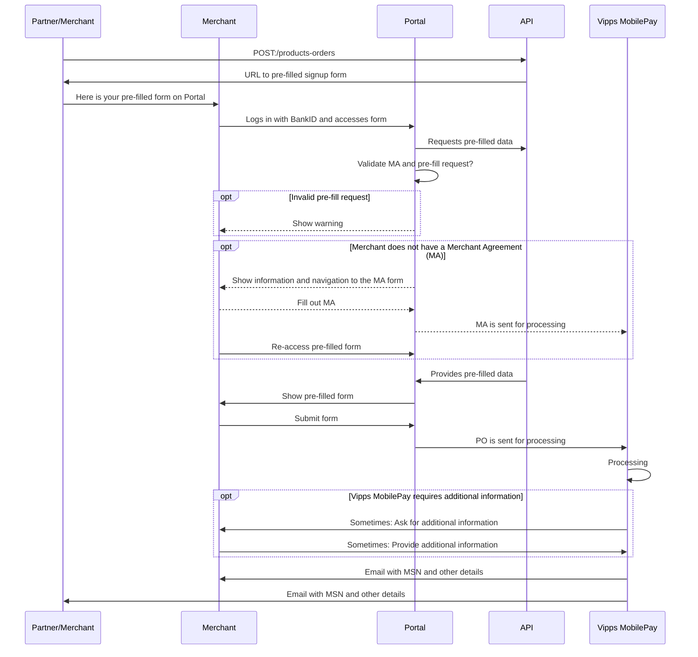

# Order pre-fill

The [`POST:/management/v1/products/orders`](https://developer.vippsmobilepay.com/api/management/#tag/Product-orders/operation/orderProduct) endpoint allows for "pre-fill" of the product order form on
[portal.vipps.no](https://portal.vipps.no).

This ensures that all the data in the form is correctly filled in, and can also "lock" parameters that are
normally selectable. Product orders that have been pre-filled this way are
processed faster, since they are correct and contain all the required information.

The response from a pre-fill request contains a URL to
[portal.vipps.no](https://portal.vipps.no).
The merchant simply uses the URL to get to the pre-filled product order, checks the data, and submits.

**Please note:** The merchant cannot change the information provided by the partner, so if
something needs to be corrected, the merchant must contact the partner to have
the partner submit a new pre-fill product order with the correct details.

<details>
<summary>Example request</summary>
<div>

Here is a sample request to
[`POST:/management/v1/products/orders`](https://developer.vippsmobilepay.com/api/management/#tag/Product-orders/operation/orderProduct):

```json
{
  "businessIdentifier": {
    "scheme": "business:NO:ORG",
    "id": "9876543221"
  },
  "salesUnitName": "ACME Fantastic Fitness",
  "salesUnitLogo": "VGhlIGltYWdlIGdvZXMgaGVyZQ==",
  "settlementAccountNumber": "86011117947",
  "pricePackageId": "8a11afb7-c223-48ed-8ca6-4722b97261aa",
  "productType": "VIPPS_PA_NETT",
  "productUseCase": "WebsiteWithTest",
  "annualTurnover": 100000,
  "intendedPurpose": "Gym membership for accessing the gym's facilities.\nGuest will be not physically present when buying the subscription,\nas that is done on the gym's website.",
  "website": {
    "url": "https://example.com",
    "termsUrl": "https://example.com/terms-and-conditions",
    "testWebsiteUrl": "https://example.com/test ",
    "testWebsiteUsername": "test-user",
    "testWebsitePassword": "test-password"
  },
  "complianceData": {
    "giftCard": {
      "isSalesPercentageLessThanTen": false,
      "validityDuration": "3 years",
      "giftCardTurnoverShare": "about 25%"
    },
    "membership": {
      "turnoverShare": "about 25%",
      "membershipValidity": "CurrentCalendarYear",
      "periodDistribution": "50% yearly 20% monthly"
    },
    "subscription": {
      "turnoverShare": "about 25%",
      "periodDistribution": "50% yearly 20% monthly"
    },
    "course": {
      "turnoverShare": "about 25%",
      "timeBeforeOrder": "10 days",
      "period": "once every 6. week",
      "isOnlineCourseOffered": false,
      "onlineAccessibleTime": "for 3 months"
    },
    "ticket": {
      "turnoverShare": "about 25%",
      "prepurchaseTime": "10 weeks"
    },
    "rent": {
      "turnoverShare": "about 25%",
      "prepurchaseTime": "15 days",
      "averageRentalDuration": "3 weeks"
    },
    "prepaidServices": {
      "turnoverShare": "about 25%",
      "prepurchaseTime": "10 weeks"
    },
    "donation": {
      "acceptsDonation": false
    }
  }
}
```

**Important:** Please provide all the required fields, so it will not be necessary for
merchants to request more details. This is the most
[typical reason for delays](https://developer.vippsmobilepay.com/docs/partner/#typical-reasons-for-delays).

We have made as many of the fields as possible optional, but please
try to send as much as possible, to make it easy for the merchant.

Response:

```json
{
  "prefilledOrderId": "81b83246-5c19-7b94-875b-ea6d1114f099",
  "prefillUrl": "https://portal.vipps.no/register/vippspanett/81b83246-5c19-7b94-875b-ea6d1114f099"
}
```

</div>
</details>

## Processing of the pre-filled product order

When the submitted product order has been processed, an email is sent to both the
partner/merchant making the request and the merchant that submitted the pre-filled product order.
This will include information about:

* The merchant's organization number
* The merchant's name
* The sales unit's MSN
* The sales unit's name

## About "Product Order" (PO) and "Merchant Agreement" (MA)

Merchants must have both a valid Merchant Agreement (MA) and an approved
Product Order (PO) to be able to use Vipps MobilePay products.

* MA: An agreement between the merchant and Vipps MobilePay, signed with BankID.
  The MA contains information about all direct and indirect owners, any
  politically exposed persons, etc.
* PO: This is an order for a specific product (e.g., _Vipps på nett_, _Vipps Login_). The merchant
  must provide some information about the use, whether the cardholder is
  present, etc. The PO is not signed with BankID.
  A merchant may have several products, each created with a separate PO.

A merchant may order a product (submit a product order, "PO") with or
without an existing Merchant Agreement ("merchant agreement", "MA").

Both MA and PO are described in detail in
[Scenarios](#scenarios).

## Sequence diagram for pre-fill

PO: Product order. MA: Merchant agreement.



## Scenarios

**Please note:** The only way we can verify that a user is allowed
to sign a merchant agreement for a merchant is by using data from
[Brønnøysundregistrene](https://brreg.no).
It is therefore a requirement that the user logging in on
[portal.vipps.no](https://portal.vipps.no)
is registered as chairman of the board (_styreleder_) or CEO (_daglig leder_).
The user will then automatically be presented with the pre-filled PO.

### Scenario 1: The merchant does not have a Merchant Agreement

1. The partner/merchant pre-fills the PO using
   [`POST:/management/v1/products-orders`](https://developer.vippsmobilepay.com/api/partner#tag/Vipps-Product-Orders/operation/orderProduct)
   and gets a link to the pre-filled PO on
   [portal.vipps.no](https://portal.vipps.no).
2. The merchant uses the link and logs in with BankID on
   [portal.vipps.no](https://portal.vipps.no).
3. The merchant is presented with a page informing them that they need to
   sign an MA before filling in the PO.
4. The merchant re-uses the link or finds the link to the pre-filled form on the
   front page on
   [portal.vipps.no](https://portal.vipps.no)
   and is presented with the pre-filled PO,
   checks the details in the PO and submits it.
5. We process the PO and send both the merchant and partner/merchant who made the pre-fill request an
   email when done. The partner/merchant who made the pre-fill request can also check with the API:
   [`GET:/management/v1/merchants/{orgno}`](https://developer.vippsmobilepay.com/api/partner#tag/Merchants/operation/getMerchant).

When using the pre-fill link without a valid MA:


The most important part of the MA form is the "reelle rettighetshavere"
("real rights holders"), meaning the people with direct or direct ownership or
rights for the company. This is not something the partner can be expected to
know, and in any case this is information that must be signed with BankID by a
person that has signatory rights for the merchant. The form looks like this:


### Scenario 2: The merchant has an active or processing Merchant Agreement

The merchant has an MA and probably also a Vipps MobilePay product.

1. The partner/merchant pre-fills the PO using
   [`POST:/management/v1/products/orders`](https://developer.vippsmobilepay.com/api/partner#tag/Vipps-Product-Orders/operation/orderProduct)
   and gets a link to the pre-filled PO on
   [portal.vipps.no](https://portal.vipps.no).
2. The merchant uses the link and logs in with BankID on
   [portal.vipps.no](https://portal.vipps.no).
3. The merchant is presented with the pre-filled PO,
   checks the details in the PO and submits it.
4. We process the PO and send both the merchant and partner/merchant an
   email when done.
   The partner/merchant who made the pre-fill request can also check with the API:
   [`GET:/management/v1/merchants/{orgno}`](https://developer.vippsmobilepay.com/api/partner#tag/Merchants/operation/getMerchant).

In the future, we may allow the merchant to change some data pre-filled by the
partner, but this is not trivial. If the merchant changes any data, the
partner must be notified and also get the updated data. Then, they must merge and sync that
with the "old" data that was initially sent.
